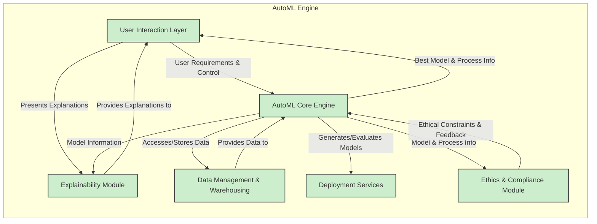

```mermaid
graph TD
    subgraph AutoML_Platform [AutoML Engine]
        direction TB
        AutoML_User_Interaction_Layer[User Interaction Layer]
        AutoML_Core_Engine[AutoML Core Engine]
        AutoML_Data_Management[Data Management & Warehousing]
        AutoML_Explainability_XAI[Explainability Module]
        AutoML_Ethics_Compliance_Module[Ethics & Compliance Module]
        AutoML_Deployment_Services[Deployment Services]
    end

    AutoML_User_Interaction_Layer -- User Requirements & Control --> AutoML_Core_Engine;
    AutoML_User_Interaction_Layer -- Presents Explanations --> AutoML_Explainability_XAI;
    AutoML_Core_Engine -- Accesses/Stores Data --> AutoML_Data_Management;
    AutoML_Core_Engine -- Generates/Evaluates Models --> AutoML_Deployment_Services;
    AutoML_Core_Engine -- Model Information --> AutoML_Explainability_XAI;
    AutoML_Core_Engine -- Model & Process Info --> AutoML_Ethics_Compliance_Module;
    AutoML_Core_Engine -- Best Model & Process Info --> AutoML_User_Interaction_Layer;
    AutoML_Ethics_Compliance_Module -- Ethical Constraints & Feedback --> AutoML_Core_Engine;
    AutoML_Explainability_XAI -- Provides Explanations to --> AutoML_User_Interaction_Layer;
    AutoML_Data_Management -- Provides Data to --> AutoML_Core_Engine;

    style AutoML_User_Interaction_Layer fill:#cec,stroke:#333,stroke-width:1.5px
    style AutoML_Core_Engine fill:#cec,stroke:#333,stroke-width:1.5px
    style AutoML_Data_Management fill:#cec,stroke:#333,stroke-width:1.5px
    style AutoML_Explainability_XAI fill:#cec,stroke:#333,stroke-width:1.5px
    style AutoML_Ethics_Compliance_Module fill:#cec,stroke:#333,stroke-width:1.5px
    style AutoML_Deployment_Services fill:#cec,stroke:#333,stroke-width:1.5px
```