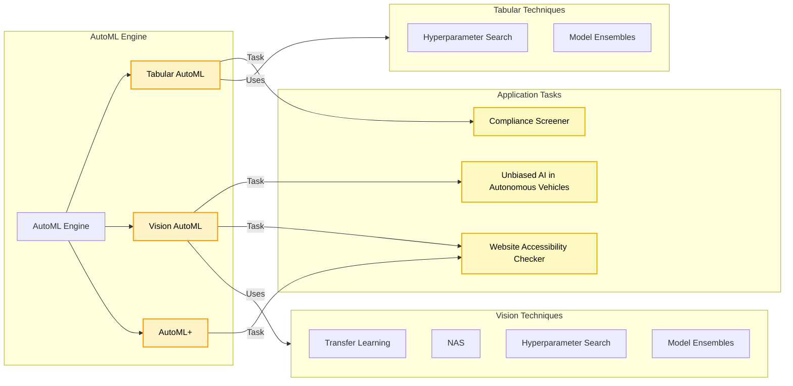

```mermaid
flowchart LR
  %% Intent and Control
  C[AutoML Engine]

  %% Core AutoML Engines
  subgraph Core_AutoML["AutoML Engine"]
    D[Tabular AutoML]
    E[Vision AutoML]
    F[AutoML+]
    C --> D
    C --> E
    C --> F
  end

  %% Tasks Using Engines
  subgraph Tasks["Application Tasks"]
    T1[Unbiased AI in Autonomous Vehicles]
    T2[Compliance Screener]
    T3[Website Accessibility Checker]
    E -->|Task| T1
    E -->|Task| T3
    D -->|Task| T2
    F -->|Task| T3
  end


  %% Tabular Path
  subgraph Tabular_Path["Tabular Techniques"]
    D2[Hyperparameter Search]
    D3[Model Ensembles]
  end

  %% Vision Path
  subgraph Vision_Path["Vision Techniques"]
    E2[Transfer Learning]
    E3[NAS]
    E4[Hyperparameter Search]
    E5[Model Ensembles]
  end

  E -->|Uses| Vision_Path
  D -->|Uses| Tabular_Path

  %% Styles
  classDef core fill:#fef3c7,stroke:#f59e0b,stroke-width:2px,color:black;
  classDef data fill:#dbeafe,stroke:#3b82f6,stroke-width:2px,color:black;
  classDef xai fill:#ecfccb,stroke:#65a30d,stroke-width:2px,color:black;
  classDef external fill:#f0f9ff,stroke:#0ea5e9,stroke-width:2px,color:black;
  classDef task fill:#fef9c3,stroke:#eab308,stroke-width:2px,color:black;

  class D,E,F core;
  class G data;
  class H xai;
  class I external;
  class T1,T2,T3 task;

```