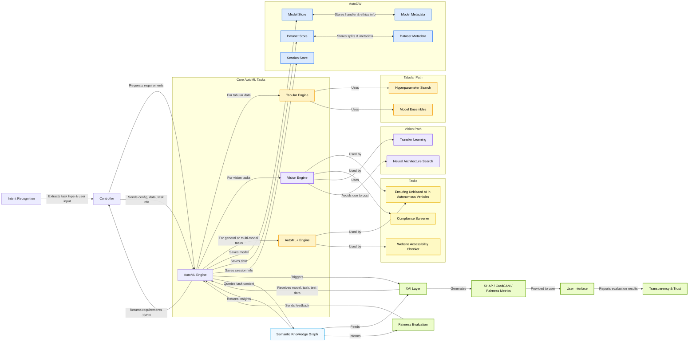

```mermaid
flowchart LR
  %% Intent and Control
  A[Intent Recognition] -->|Extracts task type & user input| B[Controller]
  B -->|Requests requirements| C[AutoML Engine]
  C -->|Returns requirements JSON| B
  B -->|Sends config, data, task info| C

  %% Core AutoML Tasks
  subgraph Core_AutoML_Tasks["Core AutoML Tasks"]
    D[Tabular Engine]
    E[Vision Engine]
    F[AutoML+ Engine]
    C -->|For tabular data| D
    C -->|For vision tasks| E
    C -->|For general or multi-modal tasks| F
  end

  %% Tasks Using Engines
  subgraph Tasks["Tasks"]
    T1[Ensuring Unbiased AI in Autonomous Vehicles]
    T2[Compliance Screener]
    T3[Website Accessibility Checker]
    F -->|Used by| T1
    E -->|Used by| T1
    E -->|Used by| T2
    F -->|Used by| T3
  end

  %% Tabular Path
  subgraph Tabular_Path["Tabular Path"]
    D2[Hyperparameter Search]
    D3[Model Ensembles]
    D -->|Uses| D2
    D -->|Uses| D3
  end

  %% Vision Path
  subgraph Vision_Path["Vision Path"]
    E2[Transfer Learning]
    E3[Neural Architecture Search]
    E -->|Uses| E2
    E -->|Avoids due to cost| E3
  end

  %% Data & Model Storage (AutoDW)
  subgraph AutoDW["AutoDW"]
    G[Model Store]
    H[Dataset Store]
    I[Session Store]
    C -->|Saves model| G
    C -->|Saves data| H
    C -->|Saves session info| I

    G1[Model Metadata]
    H1[Dataset Metadata]

    G <-->|Stores handler & ethics info| G1
    H <-->|Stores splits & metadata| H1
  end

  %% Explainability (XAI Layer)
  C -->|Triggers| J[XAI Layer]
  J -->|Receives model, task, test data| C
  J1[SHAP / GradCAM / Fairness Metrics]
  J -->|Generates| J1
  J1 -->|Provided to user| K[User Interface]
  K -->|Reports evaluation results| L[Transparency & Trust]

  %% Semantic & Fairness
  C -->|Queries task context| M[Semantic Knowledge Graph]
  M -->|Returns insights| C
  M -->|Feeds| J
  M -->|Informs| N[Fairness Evaluation]
  N -->|Sends feedback| C

  %% Styles
  classDef core fill:#fef3c7,stroke:#f59e0b,stroke-width:2px,color:black;
  classDef data fill:#dbeafe,stroke:#3b82f6,stroke-width:2px,color:black;
  classDef vision fill:#ede9fe,stroke:#8b5cf6,stroke-width:2px,color:black;
  classDef xai fill:#ecfccb,stroke:#65a30d,stroke-width:2px,color:black;
  classDef external fill:#f0f9ff,stroke:#0ea5e9,stroke-width:2px,color:black;
  classDef task fill:#fef9c3,stroke:#eab308,stroke-width:2px,color:black;

  class D,D2,D3,F core;
  class E,E2,E3 vision;
  class G,H,I,G1,H1 data;
  class J,J1,K,L,N xai;
  class M external;
  class T1,T2,T3 task;
```