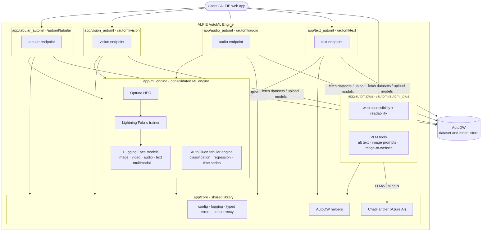

# ALFIE AutoML Engine

An AutoML engine written for the ALFIE project: a single FastAPI service
with a unified router that trains models on tabular and multimedia data and
provides LLM/VLM-powered analysis tools. Every service is mounted under one
`/automl` prefix (e.g. `POST /automl/automl_plus/accepted_format/`).

| Service | Module | Prefix | What it does |
| --- | --- | --- | --- |
| Tabular AutoML | `app/tabular_automl` | `/automl/tabular` | Trains AutoGluon models on CSV/TSV/Parquet data: classification, regression, and time series forecasting, via the shared ML engine. |
| Vision AutoML | `app/vision_automl` | `/automl/vision` | Image and video tasks (classification, segmentation, detection, keypoints) plus multimodal (image + tabular), trained via the shared ML engine. |
| Audio AutoML | `app/audio_automl` | `/automl/audio` | Audio classification, trained via the shared ML engine. |
| Text AutoML | `app/text_automl` | `/automl/text` | Text tasks (classification, question answering, causal/masked/seq2seq language modelling), trained via the shared ML engine. |
| AutoML+ | `app/automlplus` | `/automl/automl_plus` | LLM/VLM tools with no model training: web accessibility and readability analysis, alt-text checking, image prompts, and an image-to-website tool. |

The actual training code lives in one consolidated ML engine (`app/ml_engine`):
a generic Optuna + Lightning Fabric engine over Hugging Face models for image,
video, audio, text, and multimodal tasks, plus the AutoGluon-based
`AutoGluonTrainer` for tabular tasks. The service modules above are endpoints
(routers + orchestration) that call into it.

Full endpoint reference per service: [available endpoints](https://subhadityamukherjee.github.io/alfie_automl_engine/available_endpoints/).

> **Note:** branch off from `develop`, not `main`.

## ALFIE components


## Architecture



Every service follows the same layering — a thin `router.py` delegating to an
`orchestrator.py` pipeline over `services.py` helpers — on top of the shared
`app/core` library (config, logging, typed errors, AutoDW helpers, chat model
access). All model training is delegated to the consolidated `app/ml_engine`
package. For the full walkthrough of the services, the training pipeline, and
the repository layout, see the
[architecture documentation](https://subhadityamukherjee.github.io/alfie_automl_engine/architecture/).

## Getting started

### 1. Installation

Follow the [installation guide](https://subhadityamukherjee.github.io/alfie_automl_engine/installation/),
then install and run [AutoDW](https://subhadityamukherjee.github.io/alfie_automl_engine/autodw/)
(not needed if you only want AutoML+).

### 2. Configuration

You can set environment variables via the `.env` file in the project root.

- Copy the `.env.template` to `.env` and fill in whatever is missing
- Change the ports if needed
- Uploads are saved under `uploaded_data/`
- AutoML artifacts (from training) are written alongside the uploaded session folder in `automl_data_path/`

### 3. Generate sample data (optional)

The repo includes `download_sample_data.py` which downloads small datasets under `sample_data/`:

```bash
# From project root
uv run python download_sample_data.py
```

What it fetches:

- `sample_data/knot_theory/{train.csv,test.csv}` (via `wget`)
- `sample_data/m4_hourly_subset/{train.csv,test.csv}` (via `wget`)
- Hugging Face datasets `msubhaditya/garbage_collection_subset` and
  `msubhaditya/imdb_multimodal_subset` (via `huggingface_hub`)

It also uploads the datasets to a running AutoDW instance and creates a
`sample_data/test.html` for website-accessibility checks.

If `wget` is missing on macOS: `brew install wget`.

### 4. Run the service

Run the combined engine service (tabular + vision + audio + text + AutoML+
behind one unified router) — following
[running the services](https://subhadityamukherjee.github.io/alfie_automl_engine/running_the_services/).
Docker instructions are [here](https://subhadityamukherjee.github.io/alfie_automl_engine/docker_instructions/).

## After training

Once training finishes, the service points you to a folder with the trained
model, leaderboard, and metadata. To load models for inference, follow
[loading the trained model](https://subhadityamukherjee.github.io/alfie_automl_engine/loading_model/).

## Testing

The test suite and how to run it are described in the
[testing guide](https://subhadityamukherjee.github.io/alfie_automl_engine/testing/).

## Documentation

Full documentation (API reference, architecture, guides) is hosted at
[subhadityamukherjee.github.io/alfie_automl_engine](https://subhadityamukherjee.github.io/alfie_automl_engine/).
