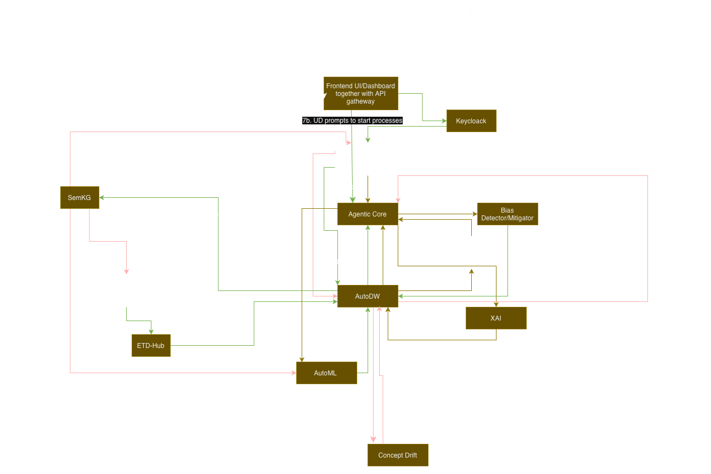
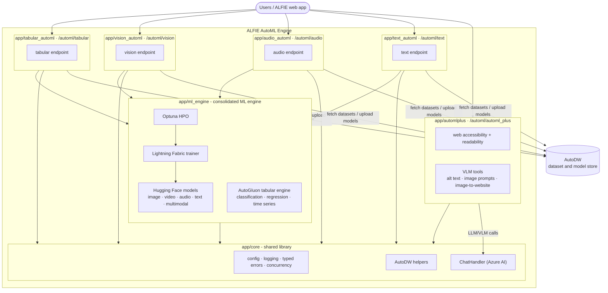

# Architecture

The ALFIE AutoML Engine is a single FastAPI service that mounts five service
modules plus a shared core library under one unified `/automl` router, all
living under `app/`. The training services talk to [AutoDW](autodw.md) to fetch
datasets and upload trained models, and delegate all model training to one
consolidated ML engine (`app/ml_engine`).





## Unified API

`app/main.py` builds a single FastAPI app and `app/api.py` mounts every
service router under one `/automl` prefix (e.g.
`POST /automl/automl_plus/accepted_format/`). Health endpoints (`/health`,
`/ready`) stay at the root. The app runs as one service on a single port
(see [running the services](running_the_services.md)).

| Service | Module | Prefix | What it does |
| --- | --- | --- | --- |
| Tabular AutoML | `app/tabular_automl` | `/automl/tabular` | Trains AutoGluon models on CSV/TSV/Parquet data (classification, regression, time series) via `app/ml_engine/tabular`. |
| Vision AutoML | `app/vision_automl` | `/automl/vision` | Image and video tasks (classification, segmentation, detection, keypoints) plus multimodal (image + tabular) via the generic ML engine. |
| Audio AutoML | `app/audio_automl` | `/automl/audio` | Audio classification via the generic ML engine. |
| Text AutoML | `app/text_automl` | `/automl/text` | Text tasks (classification, question answering, causal/masked/seq2seq language modelling) via the generic ML engine. |
| AutoML+ | `app/automlplus` | `/automl/automl_plus` | LLM/VLM tools: web accessibility analysis, alt-text checking, image prompts, readability metrics. No model training. |

## Shared core (`app/core`)

- `config.py` — typed settings over the environment (single source of truth for env vars).
- `concurrency.py` — `offload()` runs blocking work in the Starlette threadpool so async endpoints don't block the event loop.
- `exceptions.py` — the `AutoMLError` hierarchy (validation, data, runtime, upload, ...).
- `api_errors.py` — maps those exceptions to HTTP status codes (400 / 500 / 502 policy) in one place.
- `logging.py` — structlog setup plus per-service rotating log files.
- `chat_handler.py` — facade over Azure AI Inference chat models (sync, async, streaming, with images).
- `service_helpers.py` — AutoDW dataset metadata fetch / download / model upload / payload building.
- `dataset_extraction.py` — shared ZIP + CSV + media-folder dataset extraction helpers used by the vision, audio, and text pipelines.
- `health.py` — `/health` and `/ready` endpoints.
- `utils.py` — Jinja2 prompt template rendering.
- `schemas/` — Pydantic response models for the API.

## Layering inside a service

Every service module follows the same layering, so the HTTP layer stays thin:

```
app/main.py         FastAPI app + lifespan (logging setup)
   └─ app/api.py            unified router: mounts each service under /automl/<service>
        └─ router.py           bind HTTP form params, delegate, map exceptions to responses
             └─ orchestrator.py   the multi-step pipeline, raises typed exceptions
                  └─ services.py     validation, training wrappers, packaging, templates
                        └─ app/ml_engine/...   the actual training machinery
```

The training pipelines in `tabular_automl`, `vision_automl`, `audio_automl`,
and `text_automl` share the same shape:

1. Fetch dataset metadata from AutoDW.
2. Resolve the correct download URL (respecting dataset splits).
3. Download the dataset to a temporary directory (the media services also extract the ZIP).
4. Validate user-supplied parameters against the dataset.
5. Train within the given time budget (delegated to `app/ml_engine`).
6. Serialize and zip the model artifacts.
7. Upload the model and leaderboard back to AutoDW.

Blocking steps (network, training) are pushed off the event loop via `offload`.

## Consolidated ML engine (`app/ml_engine`)

All model training lives in one package so the endpoints stay thin and the
engines can evolve independently:

- `configs/` — one JSON file per task type with candidate models and
  hyperparameter search ranges.
- `tasks.py` — Pydantic task models plus the `SUPPORTED_VISION_TASK_TYPES`,
  `SUPPORTED_AUDIO_TASK_TYPES`, and `SUPPORTED_TEXT_TASK_TYPES` slugs the
  routers use to validate `task_type` form parameters.
- `dataset.py` — `BaseCSVDataset` and the Torch datasets reading samples from CSV.
- `datamodule.py` — `BaseDataModule` plus per-task datamodules (splits,
  preprocessing, DataLoaders) and `DATAMODULE_REGISTRY`.
- `model.py` — thin wrappers around Hugging Face `AutoModelFor...` classes.
- `trainer.py` — `FabricTrainer` (Lightning Fabric training loop with early
  stopping, time limits, and Optuna pruning) and `run_optuna_search`.
- `hpo/optuna_objectives.py` — one Optuna objective per task type plus
  `OBJECTIVE_REGISTRY`; `run_optuna_search` dispatches through the registry.
- `feature_mapping.py` — extracts label maps, tokenizer vocabularies, and
  fitted scaler/encoder state so preprocessing can be reproduced at inference.
- `model_search.py` — Hugging Face model discovery and small/medium/large
  size-tier filtering.
- `tabular/` — the AutoGluon tabular engine: `AutoMLTrainer`
  (`modules.py`) and the tabular task models (`models.py`) used by
  `app/tabular_automl`.

The generic engine covers image, video, audio, text, and multimodal tasks;
the vision, audio, and text endpoints simply scope which task types they
accept (`image_*` slugs on `/automl/vision`, `audio_classification` on
`/automl/audio`, text slugs on `/automl/text`).

A `feature_mapping.json` (label maps, tokenizer vocab, scaler/encoder state)
is saved alongside each trial so the preprocessing pipeline can be reproduced
when loading a trained model (see [loading the model](loading_model.md)).

## Repository layout

```
alfie_automl_engine/
├── app/
│   ├── main.py                # combined FastAPI app (single service)
│   ├── api.py                 # unified router mounting every service under /automl
│   ├── core/                  # shared library (config, logging, errors, AutoDW helpers, schemas)
│   │   ├── schemas/           # pydantic response models
│   │   └── prompt_templates/  # Jinja2 prompt and instruction templates
│   ├── ml_engine/             # consolidated ML engine (all training code)
│   │   ├── configs/           # per-task hyperparameter JSON configs
│   │   ├── hpo/               # Optuna objectives
│   │   └── tabular/           # AutoGluon tabular engine (AutoMLTrainer, task models)
│   ├── tabular_automl/        # tabular AutoML endpoint (router, orchestrator, services)
│   ├── vision_automl/         # vision AutoML endpoint (router, orchestrator, services)
│   ├── audio_automl/          # audio AutoML endpoint (router, orchestrator, services)
│   ├── text_automl/           # text AutoML endpoint (router, orchestrator, services)
│   └── automlplus/            # AutoML+ service
│       ├── tools/             # static (readability), text (LLM), vlm tools
│       └── website_accessibility/
├── docs/                      # mkdocs site (this documentation)
├── tests/                     # pytest suite (mirrors the app/ layout)
├── sample_data/               # datasets fetched by download_sample_data.py
├── plans/                     # planning notes
├── docker-compose.yml         # single API container
├── Dockerfile
├── mkdocs.yml
└── pyproject.toml
```

Runtime output (not in git): `logs/` holds per-service log files and
`uploaded_data/` holds upload artifacts.
