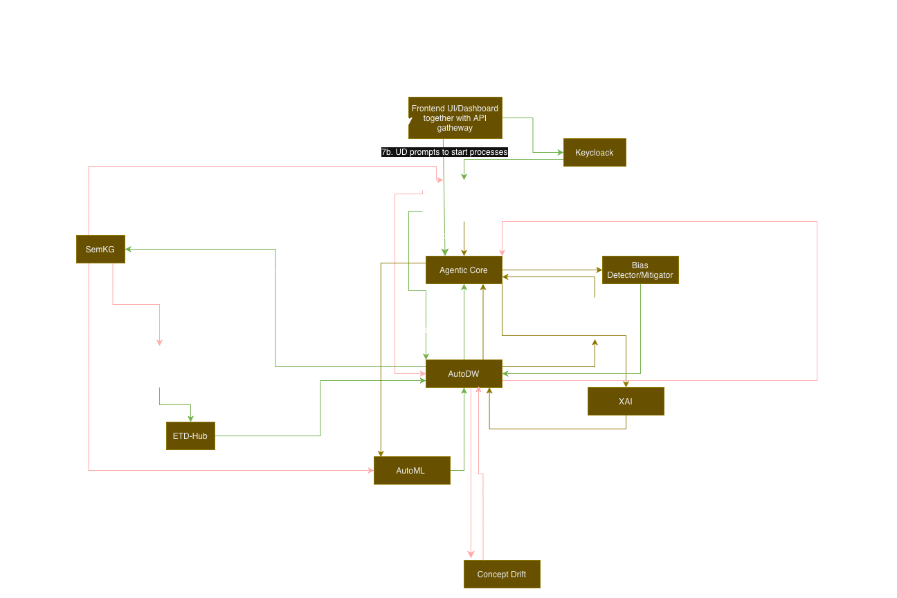

# ALFIE AutoML Engine

An AutoML engine written for the ALFIE project with the following features
- AutoML for tabular
- AutoML for vision (this is a WIP)
- Website accessibility checker
- Image to website tool
- Part of a host of tools made for better and more informed generation of AI models

## Quickstart

### Installation
- First, follow the steps here, [installation](installation.md)
- Then, follow [this](autodw.md) to install AutoDW

### Generate sample data (optional)
The repo includes `mk_sample_data.sh` which downloads small datasets under `sample_data/`:
```bash
# From project root
bash mk_sample_data.sh
```
What it fetches:
- `sample_data/knot_theory/{train.csv,test.csv}`
- `sample_data/m4_hourly_subset/{train.csv,test.csv}`

If `wget` is missing on macOS: `brew install wget`.

### Configuration
You can set environment variables via the `.env` file in the project root.

- Copy the `.env.template` to `.env` and fill in whatever is missing
- Change the ports if needed
- Uploads are saved under `uploaded_data/`.
- AutoML artifacts (from training) are written alongside the uploaded session folder in `automl_data_path/`.

### Running the AutoML
- Once you have everything setup, and the data uploaded to AutoDW, you can use the AUotML!
    - Note that if you only want to use AutoMLPlus, you don't need to use AutoDW or have it running
- Just follow [this](running_the_services.md) to run the service of your choosing

## System components


### Loading the trained model for inference
- Follow the instructions [here](loading_model.md)
- Once the AutoML tool is done, it will point you to a folder with 
